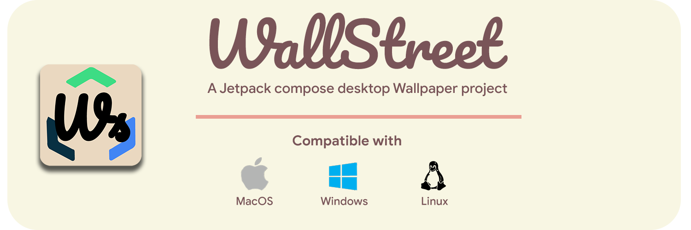
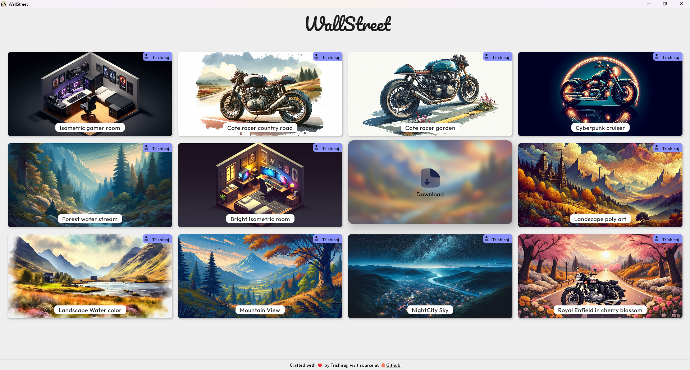

# WallStreet


[](https://github.com/StarkDroid/WallStreet)


This app leverages **Jetpack Compose Desktop** to create a beautiful and responsive Wallpaper app for any desktop platform like
**(Windows, MacOS and Linux)**. While there are a lot of Wallpaper app and alternatives out there, Here's why you would choose **WallStreet**. <br>
✅ Always free and OpenSource <br>
✅ No Ads or purchases <br>
✅ Performant, Responsive and Beautiful UI <br>
✅ Your app, your own wallpaper collection (Read below to know how you can add more wallpapers yourself) <br>
✅ Multiplatform compatibility (Windows, macOS, Linux)

### Screenshot


## Support the Project 🫶

While I love to give to the community than take, A tiny gesture of buying me a coffee☕️
is always appreciated 😁

[](https://www.buymeacoffee.com/trishiraj)<br>

### If you liked the project, star the repository to encourage me
[](https://github.com/StarkDroid/WallStreet)

> [!NOTE]
> Although the project is OpenSource, It is appreciated **not** to re-package and sell this project with the same name.
> This helps maintain authenticity of the project.

## Build it yourself 🏗️

To build and run the application on your local machine, follow these instructions:

### Prerequisites

- [IntelliJ IDEA](https://www.jetbrains.com/idea/download/) installed
- [Java Development Kit (JDK)](https://www.oracle.com/java/technologies/javase-downloads.html) installed (JDK 18 or higher)

### Steps

1. Clone this repository to your local machine:

   ```bash
   git clone https://github.com/StarkDroid/WallStreet.git
2. Open the project in IntelliJ IDEA.
3. Ensure that you have the required JDK configured in IntelliJ IDEA.
4. Build package using Gradle within the IDE to make your life easier <br>
   `Gralde icon > Tasks > compose desktop > package DistributionForCurrentOs`
5. The above step creates the installer package, i.e `.exe` and `.dmg`
6. To create an executable package, head to <br>
   `Gralde icon > Tasks > compose desktop > createDistributable`

## Contributing 🤝
> Any pull request that can make a difference and or improve the project is highly appreciated!

Feel like there's quite less count on wallpapers inside? 😟<br>
**Be the first one to contribute!** 🫵 <br>
Head over to the [WallStreet-API](https://github.com/StarkDroid/WallStreet-API) repo to know more

## Resources 📂
> Refer to these links, to learn more about the project in code level
- [Compose Multiplatform Github](https://github.com/JetBrains/compose-multiplatform)
- [Jetpack Compose](https://developer.android.com/develop/ui/compose/documentation)
- [Material Design](https://m3.material.io/)
- [Compose Multiplatform Development](https://www.jetbrains.com/help/kotlin-multiplatform-dev/compose-multiplatform-getting-started.html)


## License 📃

```
Copyright 2024 - 25 Trishiraj

Licensed under the Apache License, Version 2.0 (the "License");
you may not use this file except in compliance with the License.
You may obtain a copy of the License at

    https://www.apache.org/licenses/LICENSE-2.0

Unless required by applicable law or agreed to in writing, software
distributed under the License is distributed on an "AS IS" BASIS,
WITHOUT WARRANTIES OR CONDITIONS OF ANY KIND, either express or implied.
See the License for the specific language governing permissions and
limitations under the License.
```